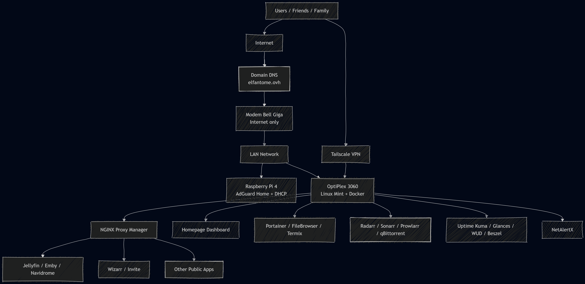

# eLFantomeLab 
Infrastructure homelab auto-hébergée basée sur Linux, Docker et reverse proxy, permettant d’exposer plusieurs services web sécurisés via sous-domaines personnalisés.

## Aperçu
Ce projet représente une infrastructure personnelle complète, similaire à un environnement de production simplifié.
- Domaine : elfantome.ovh
- Accès public via HTTPS
- Services conteneurisés
- Monitoring et supervision
- Accès distant sécurisé

##  Architecture
- Serveur principal : OptiPlex 3060 (Linux Mint)
- Noeud secondaire : Raspberry Pi 4 (Debian)
- Reverse Proxy : NGINX Proxy Manager
- DNS + sous-domaines personnalisés

##  Services déployés

###  Media
- Jellyfin
- Emby
- Navidrome

###  Gestion média
- Radarr
- Sonarr
- Prowlarr
- qBittorrent
- Wizarr

###  Réseau
- AdGuard
- Tailscale
- NetAlertX

###  Monitoring
- Uptime Kuma
- Glances
- Beszel
- What's Up Docker

###  Outils
- Portainer
- FileBrowser
- Web SSH

##  Fonctionnalités
- Reverse proxy avec sous-domaines
- HTTPS (Let’s Encrypt)
- Accès distant sécurisé
- Monitoring en temps réel
- Dashboard centralisé
- Infrastructure multi-services

##  Compétences démontrées
- Administration Linux
- Docker / Docker Compose
- Réseau et DNS
- Reverse proxy
- SSL / HTTPS
- Monitoring et logs
- Auto-hébergement
- Troubleshooting

##  Objectif
Démontrer des compétences concrètes en infrastructure IT, sysadmin et DevOps junior.

## Screenshots



## Docker Stacks
```md
- **Servarr** → Radarr, Sonarr, Prowlarr
- **Monitoring** → Uptime Kuma, Glances, NetAlertX, Beszel, WUD
```
## Status

### Complété
- Architecture documentée
- Diagramme réseau
- Docker stacks (servarr, monitoring)
- .env.example
- Quick start

###  En cours
- documentation détaillée des stacks
- amélioration du monitoring

## 🚀 Example de Quick Start 

```bash
git clone https://github.com/elfant0me/elfantomelab
cd elfantomelab/docker
cd jellyfin
docker compose up -d
```
```md
##
- Linux system administration
- Docker / containerization
- Reverse proxy & HTTPS
- Network configuration
- Monitoring & observability
- Self-hosted infrastructure
```
##  Auteur
François Gilbert  
Technicien informatique autodidacte
