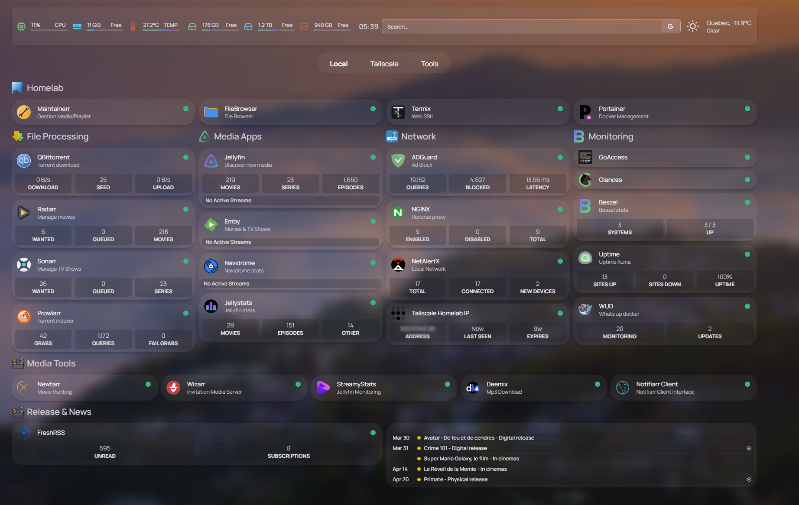

# eLFantomeLab

> Infrastructure homelab auto-hébergée démontrant des compétences concrètes en Linux, Docker, réseau et DevOps.

Infrastructure basée sur Linux, Docker et reverse proxy, permettant d’exposer plusieurs services web sécurisés via des sous-domaines personnalisés.

---

## Aperçu

Ce projet représente une infrastructure personnelle complète, inspirée d’un environnement de production simplifié.

- Domaine : elfantome.ovh  
- Accès public via HTTPS  
- Services conteneurisés  
- Monitoring et supervision  
- Accès distant sécurisé  

---

## Architecture

- Serveur principal : OptiPlex 3060 (Linux Mint)  
- Nœud secondaire : Raspberry Pi 4 (Debian)  
- Reverse Proxy : NGINX Proxy Manager  
- DNS + sous-domaines personnalisés  

---

## Services principaux

- Streaming média (Jellyfin, Emby, Navidrome)
- Automatisation (Radarr, Sonarr, Prowlarr)
- Réseau et sécurité (NGINX Proxy Manager, AdGuard, Tailscale)
- Monitoring (Uptime Kuma, Glances, Beszel)
- Administration (Portainer, FileBrowser, Homepage)

---

## ⚙️ Fonctionnalités

- Reverse proxy avec sous-domaines  
- HTTPS (Let’s Encrypt)  
- Accès distant sécurisé  
- Monitoring en temps réel  
- Dashboard centralisé  
- Infrastructure multi-services  

---

## 🧠 Compétences démontrées

- Administration Linux  
- Docker / Docker Compose  
- Réseau et DNS  
- Reverse proxy  
- SSL / HTTPS  
- Monitoring et logs  
- Auto-hébergement  
- Troubleshooting  

---

## Objectif

Démontrer des compétences concrètes en infrastructure IT, sysadmin et DevOps junior.

---

## Screenshots
Interface du dashboard permettant l’accès rapide aux services.
  

---

## 🐳 Docker Stacks

L’infrastructure est organisée en plusieurs stacks logiques afin de séparer les responsabilités et faciliter la maintenance.
> Certains services sont exposés publiquement via HTTPS (NGINX Proxy Manager), tandis que d’autres sont accessibles uniquement via Tailscale pour des raisons de sécurité.

### 🎬 Media
Services multimédia accessibles via le reverse proxy (NGINX Proxy Manager).

- Jellyfin (streaming vidéo)
- Emby (compatibilité TV Samsung)
- Navidrome (streaming musique)
- Deemix (téléchargement musique)

---

### 📊 Monitoring
Outils de supervision, statistiques et disponibilité des services.

- Uptime Kuma (monitoring des services)
- Glances (monitoring système)
- Beszel (dashboard système)
- Jellystat (stats Jellyfin)
- NetAlertX (détection appareils réseau)
- Streamystats (statistiques streaming)
- NPM GoAccess (logs reverse proxy)
- WUD (mise à jour des containers)

---

### 🌐 Network
Gestion de l’accès réseau et exposition des services.

- NGINX Proxy Manager (reverse proxy + HTTPS)
- Gestion des sous-domaines
- Configuration via `.env`

---

### 📦 Servarr
Automatisation du téléchargement et gestion de contenu.

- Radarr (films)
- Sonarr (séries)
- Prowlarr (indexeurs)
- qBittorrent (téléchargement)
- FlareSolverr (contournement Cloudflare)

---

### 🛠️ Tools
Outils utilitaires pour la gestion et l’administration du serveur.

- Portainer (gestion Docker)
- FileBrowser (gestion fichiers)
- Homepage (dashboard)
- Wizarr (gestion utilisateurs)
- Maintainerr (gestion bibliothèque)
- Notifiarr (notifications)
- Termix (terminal web)
- Newtarr (automation complémentaire)

---

### ⚙️ Organisation
Chaque service possède :
- son propre dossier
- un `docker-compose.yml`
- un `README.md`
- une configuration isolée

---

## Status

### Complété
- Architecture documentée  
- Diagramme réseau  
- Docker stacks (servarr, monitoring, tools, network)  
- Fichiers `.env.example`  
- Quick Start  

### En cours
- Documentation détaillée des stacks  
- Amélioration du monitoring  
- Ajout des stacks media et autres services  

---

## Auteur

François Gilbert  
Technicien informatique autodidacte
